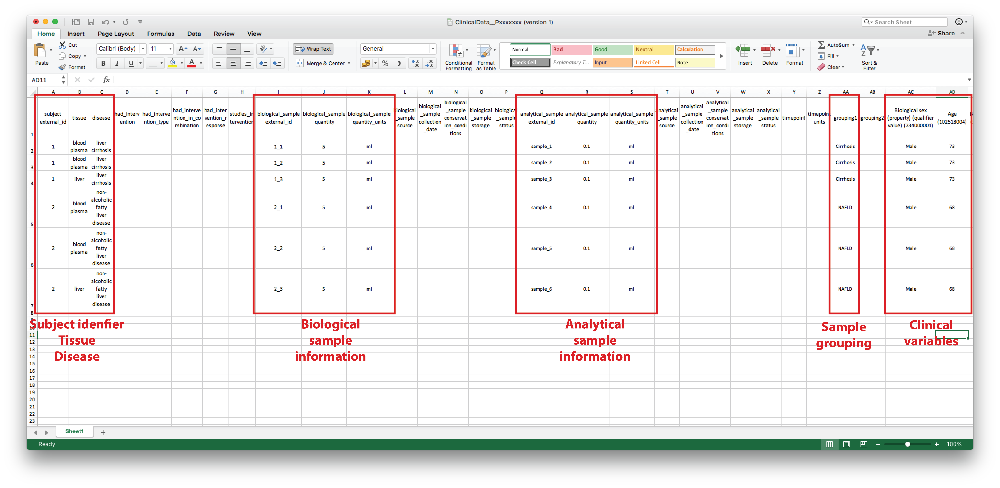
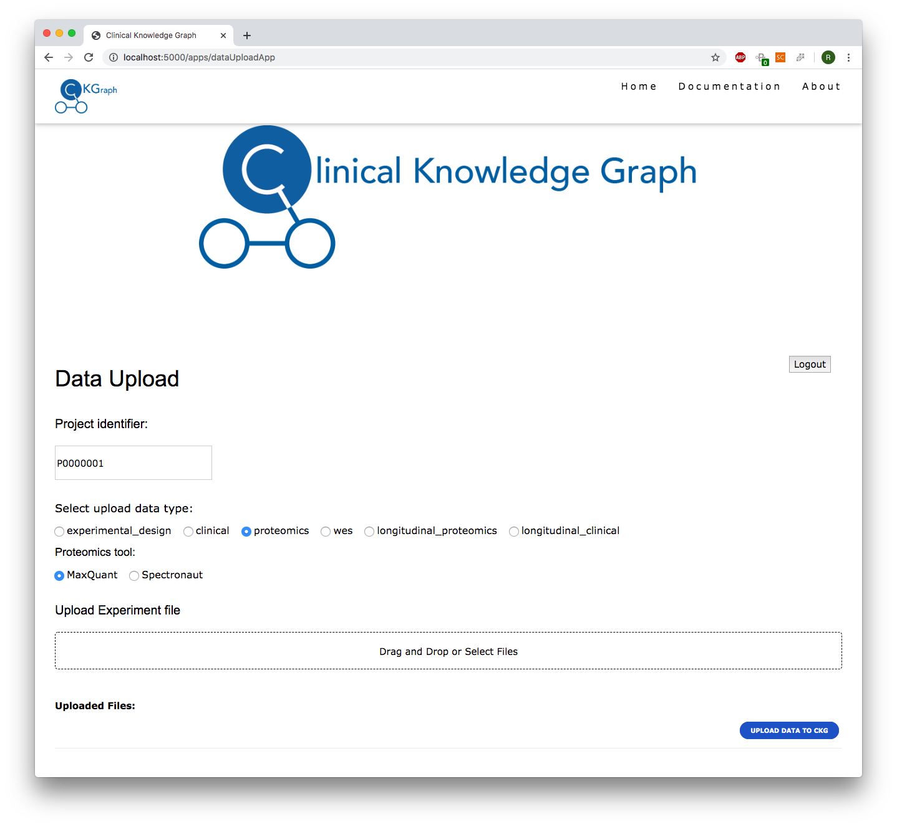

.. _Upload Data:

NOT FINISHED!!!!

Upload project experimental data
==================================

Prepare data for upload
-----------------------

Clinical Data
^^^^^^^^^^^^^^^^^^

    Clinical Data file example

Open the Clinical Data excel file, automatically downloaded when the project was created, and fill in as much information as you can.
Be aware that the following columns are mandatory to fill in:

- **subject external_id**: This is the identifier your subject has in your study so far.

- **tissue**: This is the name of the tissue each sample came from. Make sure it is also one of the tissues selected during Project creation.

- **disease**: This should match the disease(s) you selected from the drop-down menu in the :ref:`Project Creation`.

- **biological_sample external_id**: This is the identifier of the sample taken from your subject, if you have both blood and urine for every subject, you should correspondingly have two biological sample identifiers for each subject identifier.

- **biological_sample quantity**: Amount of biological sample.

- **biological_sample quantity_units**: Unit.

- **analytical_sample external_id**: If multiple analyses were performed on the same biological sample, eg. proteomics and transcriptomics, there should be multiple analytical sample identifiers for every biological sample.

- **analytical_sample quantity**: Amount of sample used in the experiment.

- **analytical_sample quantity_units**: Unit.

- **grouping1**: Annotated grouping of each sample.

- **grouping2**: If there are more than one grouping (two independent variables) use this column to add a second level.

Additional clinical information about your study subjects can be added in the subsequent columns (i.e. columns after "grouping2").
Please use SNOWMED terms as headers for every new column you add. This will be used to gather existing information about the type of data you have.
To find an adequate SNOMED term for your clinical variables, please visit the `SNOMED browser <https://browser.ihtsdotools.org/?perspective=full&conceptId1=734000001&edition=MAIN/2019-07-31&release=&languages=en>`_.

.. note:: Be aware, the two-independent-variable statistics is not yet implemented in the default analysis pipeline.

.. note:: To add a column with "Age" search for "age" in the SNOMED browser. This gives multiple matches, with the first one being: "Age (qualifier value), SCTID:397669002". Please enter this information as your clinical variable column header with the SCTID in brackets: Age (qualifier value) (397669002)

.. warning:: If an adequate SNOMED term is not available, please write an e-mail to annelaura.bach@cpr.ku.dk with the subject "Header Creation, CKG". In the email please provide your "missing" header and a description of what it is. Do this before uploading the Clinical Data.

**Additional columns:**

- **had_intervention**: If a subject has been subjected to a determined medical intervention. For now, select only drugs that have been given to the subject (e.g. "327032007"). Use an appropriate SNOMED SCTID value.

- **had_intervention_type**: This is the type of intervention applied to a subject. "drug treatment" is the only value available for now.

- **had_intervention_in_combination**: Boolean. If True, requires more than one value in **had_intervention**.

- **had_intervention_response**: "positive" or "negative".

- **studies_intervention**: A medical intervention under study in the project. For example, study subjects before and after stomach bypass (SCTID:442338001). Use an appropriate SNOMED SCTID value.

Proteomics data
^^^^^^^^^^^^^^^^^^

Do not perform any imputations or similar on your data before uploading it. This will be carried out by the CKG.
You can proceed to :ref:`Upload` when you have prepared your experimental design file, and clinical and proteomics data.

.. _Upload:

Upload data
-------------

    Data Upload App

In order to make data uploading simple, we created an app that takes care of this in only a few steps:

Go to `dataUploadApp <http://localhost:5000/apps/dataUploadApp/>`_ or use the ``Data Upload`` button in the `homepage app <http://localhost:5000/>`_, and follow the steps.

1. Fill in ``Project identifier`` with your project external identifier from :ref:`Project Creation` and press *Enter*. **(1)** If the project identifier does not exist in the database, you will get and error. Otherwise, the menus below will unlock.

#. Select the type of data you will upload first. **(2)**

	- If ``proteomics`` or ``longitudinal_proteomics`` is selected, please also select the processing tool used (``MaxQuant`` or ``Spectronaut``). **(2a)**

#. Drag and drop or select the files to upload to the selected data type. **(3)**
	
	- Multiple files can be selected at once. This is specially important in the case of proteomics files, please make sure you select all of the relevant MS files at once.

#. Select another data type to upload **(2)**, and drag and drop or select the files to upload **(3)**.

#. When you have uploaded all the relevant files, click ``UPLOAD DATA TO CKG``. After this button is clicked, it will deactivate all the menus. To restore its function, insert the project identifier and go through the previous steps again. **(4)**

#. Once the data is uploaded, click ``Download Uploaded Files (.zip)`` to download all the upload files in a compressed format. **(5)**

.. note:: When the files are uploaded, the filenames are shown under ``Uploaded Files:`` 
			To replace the files uploaded, just select the correct data type and processing tool, and reselect the files again.

.. warning:: It is very important that you select **all** the files that should be uploaded to a certain data type **at once**.

